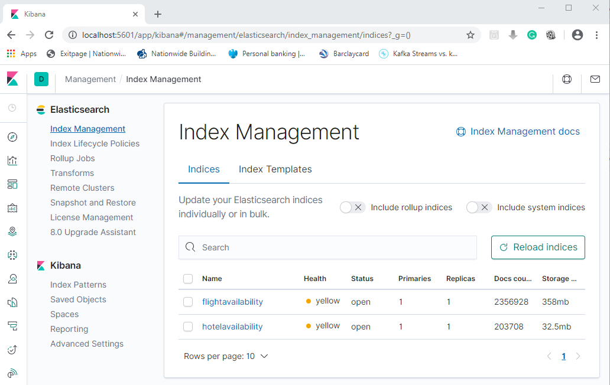

# FlightBooking.Search
ASP.NET core solution to search Flight and Hotel availability in a locally hosted Elasticsearch NoSQL database.

There are five indexes in the Elasticsearch database:
  1. flightavailability  
  2. hotel
  3. location
  4. hotelavailability  
  5. airline
  
  
  

